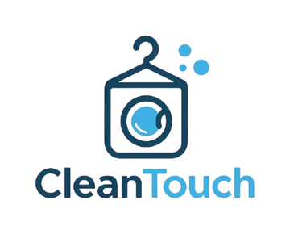

<div align="center">



# Clean Touch

**A laundry services website with booking for customers and a dashboard for providers.**

[](https://yaraaz5.github.io/CleanTouch/)


[Live demo](https://yaraaz5.github.io/CleanTouch/) · [Features](#features) · [Screenshots](#screenshots) · [Run locally](#run-it-locally)

</div>

<br>


## About

Clean Touch is a multi-page front-end website for a laundry business, built with plain **HTML, CSS and JavaScript** (no frameworks or libraries). Customers can browse and book services; the service provider can manage services and staff. Anything a user adds is saved in the browser with `localStorage`, so it is still there on the next visit.

## Features

**Customers**
- Browse services and sort them by name or price
- "Book Now" opens the request form with that service already selected
- Request a service, with validation: full name, a date at least 2 days ahead, a detailed description, and voucher codes
- Rate a service with a 1–5 star rating and feedback
- Customer dashboard showing orders and the status of previous requests (sample data)

**Service provider**
- Dashboard with live counts of services and staff
- Add new services; they appear on the dashboard and persist across visits
- Add and delete staff members; changes persist across visits

**Throughout**
- Responsive layout for phones, tablets and desktops
- Light / green theme switch, remembered between visits
- About page with team profiles, staff detail pages, and a job application form
- Back-to-top button and a live clock on the home page

## Screenshots

| Services (sortable) | Provider dashboard |
|---|---|
|  |  |

| Request a service | On a phone |
|---|---|
|  |  |

## Built with

- **HTML5** – 15 pages, semantic structure and forms
- **CSS3** – Flexbox and Grid layouts, media queries, a second colour theme
- **JavaScript (ES6)** – DOM manipulation, form validation, sorting, `localStorage`, URL parameters

## Run it locally

No build step is needed. Clone the repository and open `index.html` in a browser:

```bash
git clone https://github.com/yaraaz5/CleanTouch.git
cd CleanTouch
# open index.html, or serve the folder:
python3 -m http.server 8000   # then visit http://localhost:8000
```

**Try these:** voucher codes `DISCOUNT10` and `CLEANTOUCH20` on the request form; add a service or a staff member from the Provider Dashboard and watch the counts update.

## Project structure

```
├── index.html                  # Home: vision, offers, featured services, reviews
├── services.html               # Service list with sorting
├── about.html                  # Team, plus links to staff profiles
├── staff-*.html                # Four staff profile pages
├── join-team.html              # Job application form
├── customer-dashboard.html     # Customer overview
├── request-service.html        # Booking form
├── evaluate-service.html       # Rating form
├── provider-dashboard.html     # Provider overview
├── add-service.html            # Add a service
├── manage-staff.html           # View / delete staff
├── add-staff.html              # Add a staff member
├── css/style.css               # All styles, including the green theme
├── js/script.js                # All page behaviour
├── images/
└── docs/screenshots/
```

## Team

Built by a team of four Information Technology students at King Saud University (October–November 2025):

- Najla Alhusaini
- Tala Alqahtani
- Latifah Alsaif
- Yara Zakzouk
